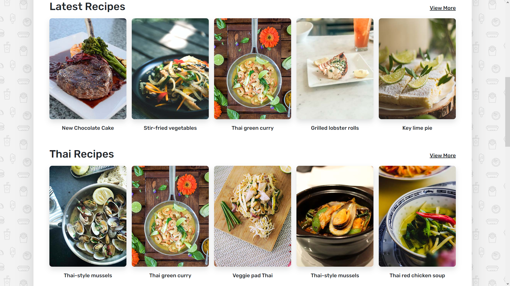
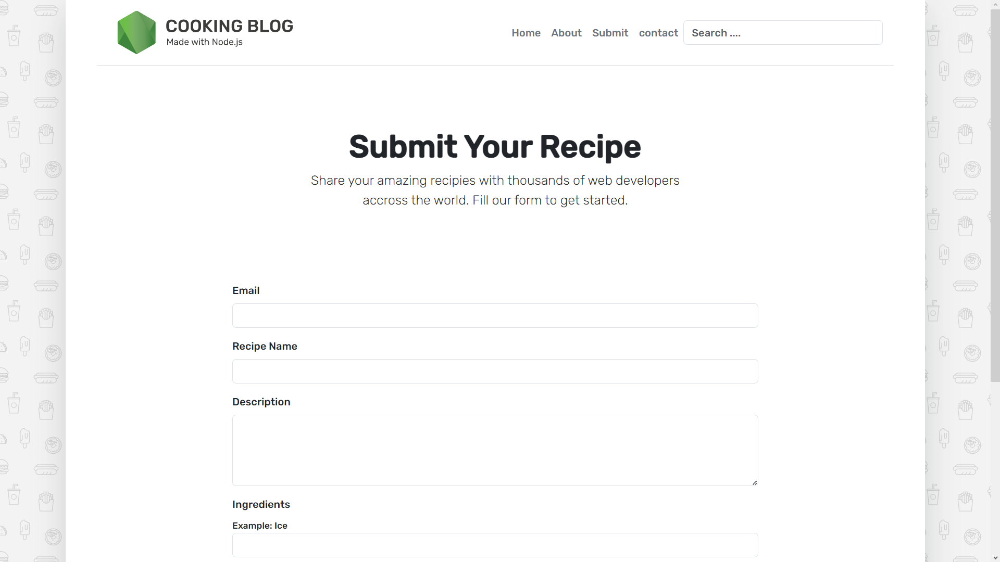

# Cooking -Blog
It is a full stack cooking blog built using ejs, [](https://skills.thijs.gg)

<hr>
1. First download the git repo<br>
2. Change the database configuration <br>

3. Run the project

```javascript
npm start
```


## Landing Page


## Category Section


## Submit Section


## Submit Page


## Search Option


<hr>

